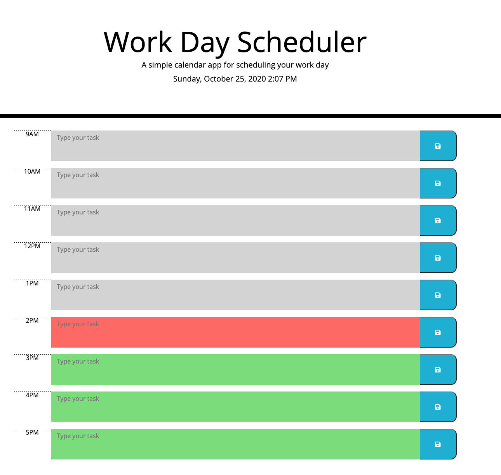

# Project Objective

Link: https://speloqu24.github.io/Planner/

The main objective of this project was to create a day planner that allows users to see at a glance, past, present and future time blocks. Users are able to log tasks for the day and come back to the planner later on, after closing the browser, to reference their schedule.

# HTML

At first I created each HTML element dynamically, but ran into a bit of hiccup when I wanted to retrieve items out of local storage due to the lack of identification of specific items. Either way, I ended up creating a div for each row/time-block that had specific id's and classes attributed to them. This allowed me to directly target specific elements through local storage and event listeners.

# JavaScript and jQuery

As you'll see there is a mixture of vanilla JavaScript and jQuery. The reason for that is was functionality. There were some things that I was having a hard time grabbing with just JS, jQuery seemed to be the correct approach for me for conditioning.

# Color Conditionals

This planner displays different colors depending on the current hour and the hour listed on the planner.

If the current hour > the hour block it's in the past which is represented by the block color being grey.

If the current hour === the hour block it's in the present which is represented by the block color being red.

If the current hour < the hour block it's in the past which is represented by the block color being green.

This seemed to be the harder part for me on this project. I had to make sure that I was comparing apples to apples, which is why I grabbed the ID for teach timeblock element in HTML, turned it into a number and made sure that number went up against the current hour. The challenge here was learning how to grab JUST the ID.

# New techniques

First time I've used .each, which helped in targeting EACH of the .timeblock elements

First time using (this) in an assignment, which helped me refer again to the ID elements

# ScreenShot

